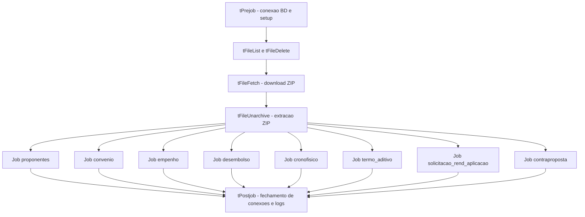
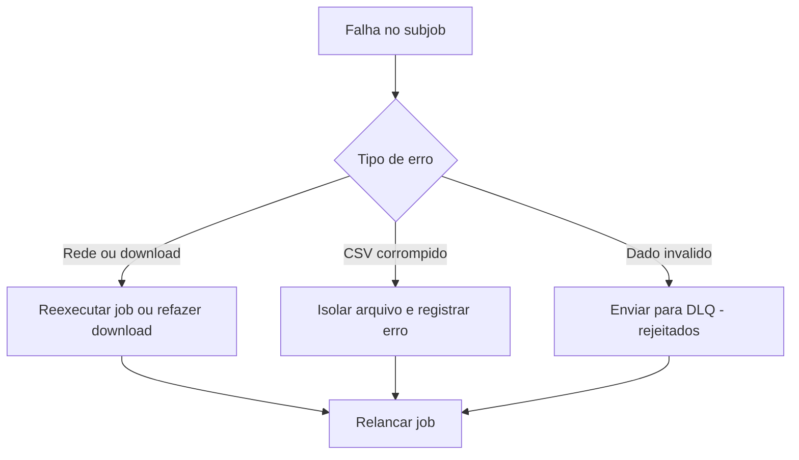

# Convexus – ETL TransferGov para PostgreSQL (Talend) — **As-Built (Correção Mermaid)**

## 4.1 Grafo de Orquestração do Job (corrigido)

---

## 8. Política de Erros & Reprocessamento (corrigido)

---

✅ **Correção aplicada:**  
Esses diagramas foram ajustados para compatibilidade com **Mermaid v10+** e renderizadores do **GitHub/Confluence**, removendo caracteres especiais que causavam erros (`*`, `/`, `ç`, `()`, acentos etc.).
