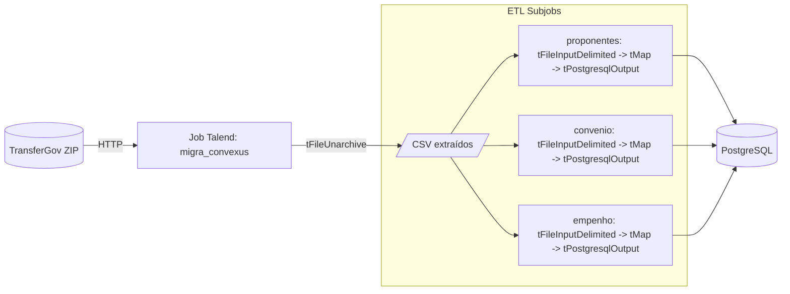
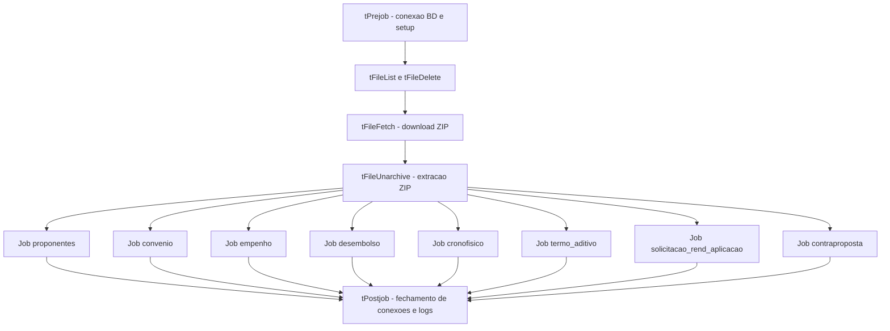
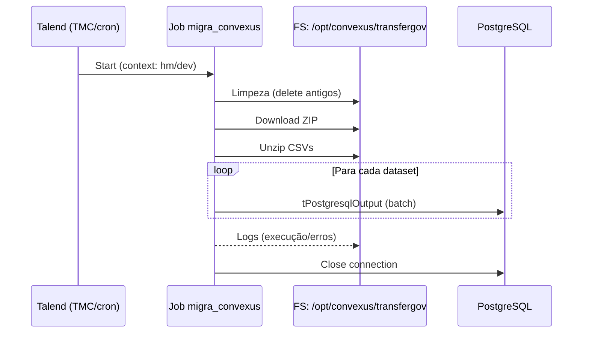
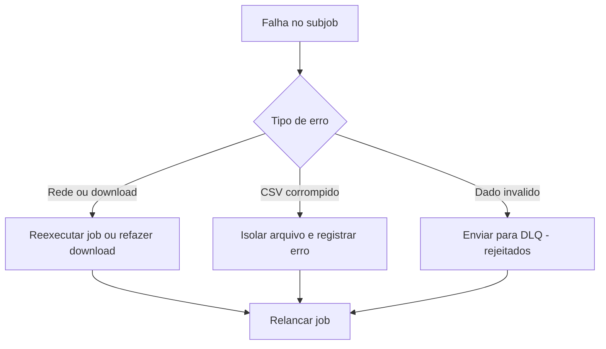
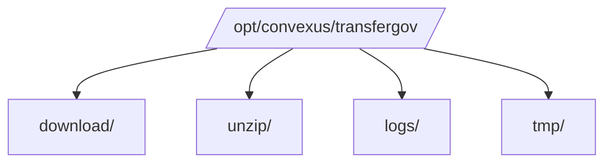

# Convexus – ETL TransferGov para PostgreSQL (Talend)

> **Propósito:** Documentar **o que está em produção** (já implementado) no Talend — arquitetura, componentes, parâmetros, orquestração, datasets, mapeamentos, observabilidade e procedimentos operacionais.  
> **Escopo:** Coleta do ZIP do TransferGov, extração dos CSVs, transformação e carga em PostgreSQL.  
> **Plataforma:** Talend (compatibilidade 8.0.1).  
> **Job principal:** `migra_convexus` (versões publicada: `0.1.46`).  
> **Ambiente TMC:** `default` • **Workspace:** `Personal (Lucas Guerreiro)` • **Type:** `Job`.

---

## 1. Visão Executiva (limitada a três tabelas)



**Resultado:** Tabelas populadas no PostgreSQL (schema `transferegov`), consumíveis pela app `konvexus`.

---

## 2. Inventário do Ativo

| Item | Valor |
|---|---|
| **Job** | `migra_convexus` |
| **Compatibilidade** | 8.0.1 |
| **Publisher** | Lucas Guerreiro |
| **Ambiente** | `default` |
| **Workspace** | `Personal (Lucas Guerreiro)` |
| **Orquestração** | TMC (agendamento) ou cron |
| **Diretórios** | `/opt/convexus/transfergov/{download,unzip,logs,tmp}` |
| **Fonte** | `https://repositorio.dados.gov.br/seges/detru/siconv.zip` |
| **Destino** | PostgreSQL (`convexus_dev_db`/`convexus_hm_db`) |
| **Conector** | JDBC PostgreSQL (`tPostgresqlConnection`) |
| **Batch** | Habilitado nos `tPostgresqlOutput` |
| **Logs** | `tLogCatcher` → arquivo em `/logs` |

---

## 3. Parâmetros & Contextos

### 3.1 Context Group `ctx_transfergov`

| Variável | dev | hm | Descrição |
|---|---|---|---|
| `URL_ZIP` | \- | \- | `https://repositorio.dados.gov.br/seges/detru/siconv.zip` |
| `DIR_DOWNLOAD` | `/opt/convexus/transfergov/download` | idem | Pasta de download |
| `DIR_UNZIP` | `/opt/convexus/transfergov/unzip` | idem | Pasta para CSVs |
| `DIR_LOGS` | `/opt/convexus/transfergov/logs` | idem | Logs |
| `PG_HOST` | `caracas.tarea.lan` | idem | Host PostgreSQL |
| `PG_PORT` | `5432` | idem | Porta |
| `PG_DB` | `convexus_dev_db` | `convexus_hm_db` | Database |
| `PG_USER` | `tarea` | `tarea` | Usuário |
| `PG_PASS` | **segredo** | **segredo** | Criptografado no Talend |
| `BATCH_SIZE` | `5000` | `5000` | Commit em lote |
| `TRUNCATE_BEFORE_LOAD` | `false` | `false` | Trunca antes de carregar |

> **Padrão de segurança**: credenciais armazenadas no Talend com criptografia de contexto; permissão de pasta restrita ao sistema `etl`.

---

## 4. Arquitetura e Orquestração

## 4.1 Grafo de Orquestração do Job



**Dependências funcionais (exemplo prático):** `proponentes` → `convenio` → `empenho` → `desembolso`. Subjobs independentes rodam em sequência via `OnComponentOk` para reduzir contenção de I/O.

### 4.2 Topologia de Execução



---

## 5. Datasets, Esquemas & Mapeamentos

> Os nomes a seguir refletem o padrão observado. Ajuste se necessário conforme publicação do TransferGov.

| Dataset | Arquivo de origem | Tabela destino | Observações de mapeamento (tMap) |
|---|---|---|---|
| Proponentes | `proponentes.csv` | `public.siconv_proponentes` | Normalização de CNPJ/CPF; trim; `data_cadastro` para `date` |
| Convênio | `convenio.csv` | `public.siconv_convenio` | FK `id_proponente`; `valor_global` → `numeric(18,2)`; parse de datas |
| Empenho | `empenho.csv` | `public.siconv_empenho` | Conversões monetárias; chaves de referência ao convênio |
| Desembolso | `desembolso.csv` | `public.siconv_desembolso` | Campos financeiros; datas e situação |
| Crono Físico | `cronofisico.csv` | `public.siconv_cronofisico` | Percentuais numéricos; datas |
| Termo Aditivo | `termo_aditivo.csv` | `public.siconv_termo_aditivo` | Vínculo ao convênio; situação |
| Solicitação Rend. Aplicação | `solicitacao_rendimento_aplicacao.csv` | `public.siconv_sra` | Texto e datas; valores |
| Contraproposta | `contraproposta.csv` | `public.siconv_contraproposta` | Situação; relacionamento ao convênio |

**Padrões do `tPostgresqlOutput`:** `Action on table: None` • `Action on data: Insert` (ou `Insert or Update` quando PK definida) • `Commit every: ${context.BATCH_SIZE}` • `Use Batch Size: true`.

---

## 6. Regras de Transformação (alto nível)

- **Sanitização**: `trim()`, remoção de caracteres não numéricos em identificadores, lower/upper quando aplicável.  
- **Datas**: parsing `dd/MM/yyyy` → `yyyy-MM-dd`. Valores inválidos são direcionados ao fluxo de erro ou substituídos por `NULL` conforme regra.  
- **Numéricos**: vírgula para ponto; cast seguro para `numeric(18,2)`.  
- **Chaves**: composição de PK/UK a partir do identificador do dataset quando disponível; validação de duplicidades com `tUniqueRow` (quando aplicado).  
- **Codificação**: `UTF-8` esperado em todos os CSVs.

---

## 7. Operação, SLA e Observabilidade

### 7.1 Janela & Frequência
- **Periodicidade:** diária (padrão) — agendada via TMC/cron.  
- **Janela sugerida:** fora do horário comercial para reduzir disputa de recursos.  

### 7.2 Metas (SLA/SLI)
- **Disponibilidade do Job:** ≥ 99%.  
- **Latência da carga:** ≤ 30 min após disparo.  
- **Integridade:** zero linhas rejeitadas por tipo/dimensão (meta < 0,1%).

### 7.3 Métricas & Logs
- **Execução:** `tLogCatcher` → `${context.DIR_LOGS}/exec_YYYY-MM-DD.log`.  
- **Contagem por tabela** (amostra SQL abaixo).  
- **Alertas:** opcional via `tSendMail`/integração observabilidade.

```sql
-- Contagem por tabela (pós-carga)
SELECT 'siconv_proponentes' AS tabela, COUNT(*) FROM public.siconv_proponentes
UNION ALL SELECT 'siconv_convenio', COUNT(*) FROM public.siconv_convenio
UNION ALL SELECT 'siconv_empenho', COUNT(*) FROM public.siconv_empenho
UNION ALL SELECT 'siconv_desembolso', COUNT(*) FROM public.siconv_desembolso;
```

---

## 8. Política de Erros & Reprocessamento



- **Die on error** desabilitado nos `tPostgresqlOutput` (falhas de linha não derrubam toda a carga).  
- **Reprocessamento**: deletar CSV problemático, ajustar regra no `tMap` se necessário e **reexecutar o job**.  
- **Logs** mantidos para auditoria e diagnóstico.

---

## 9. Segurança & Acesso

- **Credenciais**: contexto Talend criptografado.  
- **SO**: permissões de pasta (proprietário `etl`, `0700`).  
- **Banco**: usuário `tarea` com privilégios mínimos necessários (`CONNECT`, `INSERT`, `UPDATE`, `SELECT` em tabelas alvo).  
- **Rede**: permitir saída HTTP para o domínio do TransferGov.

---

## 10. Consumo Analítico (Qlik) — Opcional

```qlik
LIB CONNECT TO 'PostgreSQL_Convexus';

SICONV_CONVENIO:
LOAD
    id_convenio,
    id_proponente,
    objeto,
    valor_global,
    data_assinatura
SQL SELECT
    id_convenio,
    id_proponente,
    objeto,
    valor_global,
    data_assinatura
FROM public.siconv_convenio;
```

---

## 11. Mudanças Relevantes (Histórico)

| Data | Versão | Descrição |
|---|---|---|
| 2025-11-06 | 0.1.46 | Publicação/estabilização do job `migra_convexus` no TMC. Padronização de contextos e batch. |
| 2025-11-06 | - | Consolidação desta documentação **as‑built** com diagramas Mermaid. |

---

## 12. Apêndice — Topologia de Pastas



**Observação:** rotação de logs recomendada (logrotate) e limpeza periódica de `download/` e `unzip/` (mantendo apenas o último ciclo).

---

**Responsável técnico:** Lucas Guerreiro  
**Contato:** (preencher)  
**Repositório/Projeto:** (preencher)
