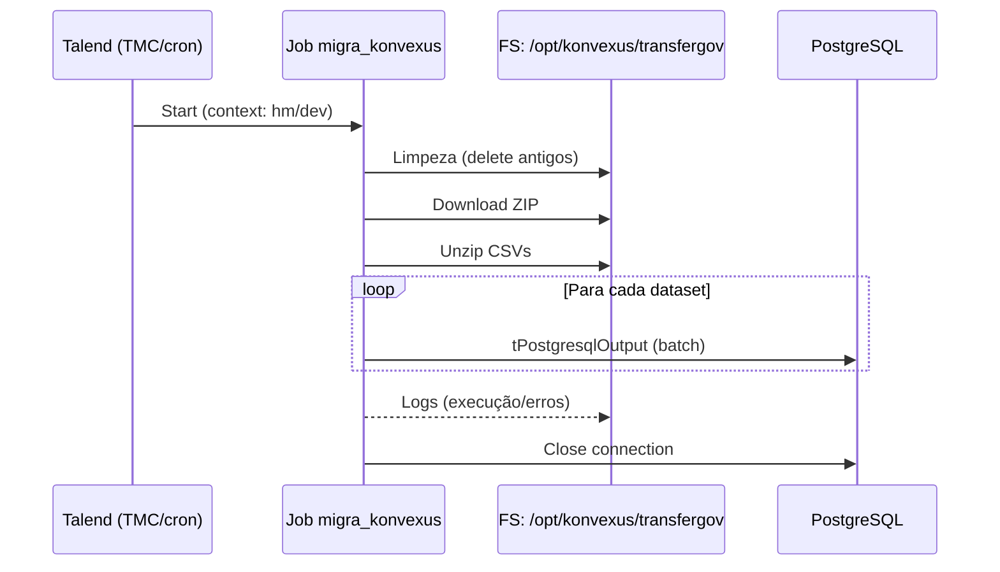
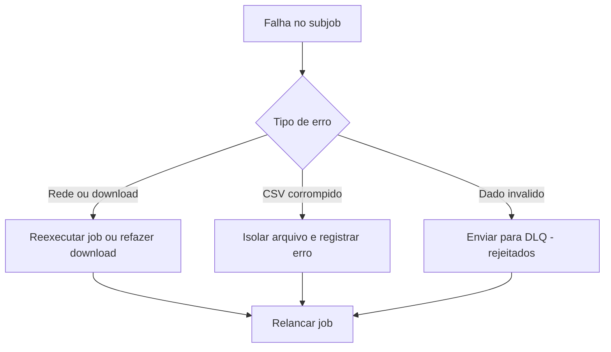
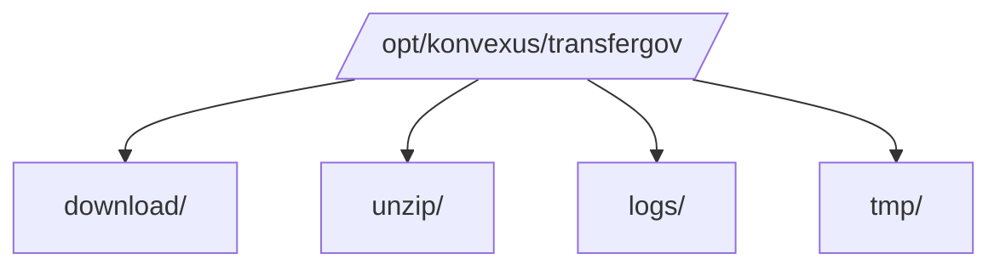

# konvexus – ETL TransferGov para PostgreSQL (Talend)

> **Propósito:** Documentar **o que está em produção** (já implementado) no Talend — arquitetura, componentes, parâmetros, orquestração, datasets, mapeamentos, observabilidade e procedimentos operacionais.  
> **Escopo:** Coleta do ZIP do TransferGov, extração dos CSVs, transformação e carga em PostgreSQL.  
> **Plataforma:** Talend (compatibilidade 8.0.1).  
> **Job principal:** `migra_konvexus` (versões publicada: `0.1.46`).  
> **Ambiente TMC:** `default` • **Workspace:** `Personal (Lucas Guerreiro)` • **Type:** `Job`.

---

## 1. Visão Geral (limitada a três tabelas)


**Resultado:** Tabelas populadas no PostgreSQL (schema `transferegov`), consumíveis pela app `konvexus`.

---

## 2. Inventário do Ativo

| Item | Valor |
|---|---|
| **Job** | `migra_konvexus` |
| **Compatibilidade** | 8.0.1 |
| **Publisher** | Lucas Guerreiro |
| **Ambiente** | `default` |
| **Workspace** | `Personal (Lucas Guerreiro)` |
| **Orquestração** | TMC agendado |
| **Diretórios** | `/opt/konvexus/transfergov/{download,unzip,logs,tmp}` |
| **Fonte** | `https://repositorio.dados.gov.br/seges/detru/siconv.zip` |
| **Destino** | PostgreSQL (`konvexus_dev_db`/`konvexus_hm_db`) |
| **Conector** | JDBC PostgreSQL (`tPostgresqlConnection`) |
| **Batch** | Habilitado nos `tPostgresqlOutput` |
| **Logs** | `tLogCatcher` → arquivo em `/logs` |

---

## 3. Parâmetros & Contextos

### 3.1 Context Group `transfergov`

| Variável | dev | hm | Descrição |
|---|---|---|---|
| `URL_ZIP` | \- | \- | `https://repositorio.dados.gov.br/seges/detru/siconv.zip` |
| `DIR_DOWNLOAD` | `/opt/konvexus/transfergov/download` | idem | Pasta de download |
| `DIR_UNZIP` | `/opt/konvexus/transfergov/unzip` | idem | Pasta para CSVs |
| `DIR_LOGS` | `/opt/konvexus/transfergov/logs` | idem | Logs |
| `PG_HOST` | `caracas.tarea.lan` | idem | Host PostgreSQL |
| `PG_PORT` | `5432` | idem | Porta |
| `PG_DB` | `konvexus_dev_db` | `konvexus_hm_db` | Database |
| `PG_USER` | `tarea` | `tarea` | Usuário |
| `PG_PASS` | **segredo** | **segredo** | Criptografado no Talend |
| `BATCH_SIZE` | `5000` | `5000` | Commit em lote |
| `TRUNCATE_BEFORE_LOAD` | `false` | `false` | Trunca antes de carregar |

> **Padrão de segurança**: credenciais armazenadas no Talend com criptografia de contexto; permissão de pasta restrita ao sistema.

---

## 4. Topologia de Execução



---

## 5. Operação, SLA e Observabilidade

### 5.1 Janela & Frequência
- **Periodicidade:** diária (padrão) — agendada via TMC 07:00h.  
- **Janela sugerida:** fora do horário comercial para reduzir disputa de recursos.  

### 5.2 Metas (SLA/SLI)
- **Disponibilidade do Job:** ≥ 99%.  
- **Latência da carga:** ≤ 58 min após disparo.  
- **Integridade:** zero linhas rejeitadas por tipo/dimensão (meta < 0,1%).

### 5.3 Métricas & Logs
- **Execução:** `tLogCatcher` → `${context.DIR_LOGS}/exec_YYYY-MM-DD.log`.  
- **Contagem por tabela** (amostra SQL abaixo).

```sql
-- Contagem por tabela (pós-carga ex:)
SELECT 'siconv_proponentes' AS tabela, COUNT(*) FROM public.siconv_proponentes
UNION ALL SELECT 'siconv_convenio', COUNT(*) FROM public.siconv_convenio
UNION ALL SELECT 'siconv_empenho', COUNT(*) FROM public.siconv_empenho
UNION ALL SELECT 'siconv_desembolso', COUNT(*) FROM public.siconv_desembolso;
```

---

## 6. Política de Erros & Reprocessamento



- **Die on error** desabilitado nos `tPostgresqlOutput` (falhas de linha não derrubam toda a carga).  
- **Reprocessamento**: deletar CSV problemático, ajustar regra no `tMap` se necessário e **reexecutar o job**.  
- **Logs** mantidos para auditoria e diagnóstico.

---

## 7. Segurança & Acesso

- **Credenciais**: contexto Talend criptografado.  
- **Banco**: usuário `tarea` com privilégios mínimos necessários (`CONNECT`, `INSERT`, `UPDATE`, `SELECT` em tabelas alvo).  
- **Rede**: permitir saída HTTP para o domínio do TransferGov.

---

## 8. Topologia de Pastas


---

**Responsável técnico:** Lucas Guerreiro  
**Contato:** lucas.guerreiro@tarea.com.br 
**Repositório/Projeto:** https://app.us.cloud.talend.com/tmc/tasks-and-plans-administration/6835cc8b97f9220c51d5b275/6867ca6d859f963e923a4ba3/tasks/standard/68d374076220f9127b8e9f95/detail?from=aj9e6a4e
